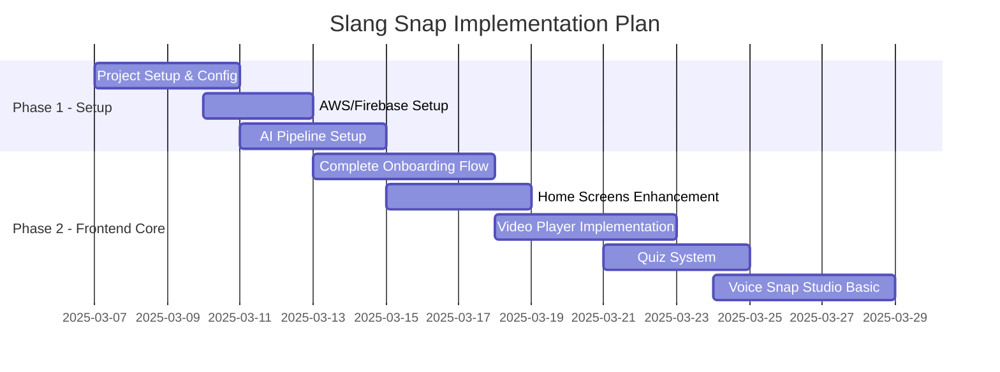

# Slang Snap Implementation Plan

## Overview

This document outlines the implementation plan for Slang Snap v5, focusing on Phase 1 (Project Setup) and Phase 2 (Frontend Core). The plan follows the requirements specified in the PRD and Technical Specifications document.

## Timeline



## Phase 1: Project Setup (Week 1-2)

### 1. Project Structure Enhancement

```
/src
  /components        # Reusable UI components
    /zoomer         # Zoomer-specific components
    /classic        # Classic-specific components
    /shared        # Shared components
  /screens          # Screen components
  /navigation       # Navigation configuration
  /store           # Redux store and slices
  /services        # API and external services
  /hooks           # Custom hooks
  /utils           # Helper functions
  /constants       # App constants
  /assets          # Images, fonts, etc.
  /styles          # Global styles
  /types           # TypeScript types
```

### 2. Configuration & Dependencies

- Required dependencies:
  - `@react-navigation/native`
  - `@react-navigation/stack`
  - `@react-navigation/bottom-tabs`
  - `@reduxjs/toolkit`
  - `react-native-video`
  - `react-native-sound`
  - `firebase`
  - `@aws-sdk/client-s3`
  - `@aws-sdk/client-dynamodb`
  - `expo-av`

- Development dependencies:
  - TypeScript
  - ESLint
  - Prettier
  - Jest

### 3. Backend Infrastructure

#### AWS Setup
- S3 Configuration
  - Buckets for video and audio storage
  - CORS configuration
  - IAM roles and policies
- DynamoDB Tables
  - Users table
  - Terms table
  - Voice Snaps table
- Lambda Functions
  - User authentication
  - Playlist generation
  - Voice Snap processing

#### Firebase Setup
- Real-time Database
  - User scores
  - Voice Snap votes
  - Live interactions
- Analytics
  - User engagement metrics
  - Feature usage tracking
- Cloud Messaging
  - Daily notifications
  - Streak reminders

### 4. AI Pipeline Setup

#### HeyGen Integration
- API authentication
- Video generation templates
- Response handling

#### Stable Diffusion Setup
- Local installation on RTX 4060 Ti
- VRAM optimization (8GB)
- Custom fine-tuning pipeline
- Frame generation optimization

## Phase 2: Frontend Core (Week 3-6)

### 1. Complete Onboarding Flow

#### Welcome Screen Enhancement
- Add animated logo
- Improve typography and spacing
- Add background patterns
- Implement smooth transitions

#### Style Picker Improvements
- Add mode preview animations
- Enhance mode cards with examples
- Add haptic feedback
- Implement smooth transitions

#### New Preferences Screen
```typescript
interface Preferences {
  interests: string[];
  notificationSettings: {
    daily: boolean;
    streaks: boolean;
    community: boolean;
  };
  soundEffects: boolean;
}
```

#### First Snap Experience
- Tutorial overlay system
- Interactive demo clip
- Practice quiz implementation
- Progress tracking

### 2. Home Screen Enhancement

#### Daily Playlist UI
- Zoomer Mode:
  - Swipeable carousel
  - Animated transitions
  - Dynamic backgrounds
- Classic Mode:
  - Clean list view
  - Progress indicators
  - Category filters

#### Features
- Streak tracking
- Points display
- Mode switcher
- Daily challenges

### 3. Video Player Implementation

#### Core Features
- Custom controls
- Progress tracking
- Dual-mode styling
- Share functionality

```typescript
interface VideoPlayerProps {
  source: string;
  mode: 'zoomer' | 'classic';
  onComplete: () => void;
  onShare: () => void;
}
```

### 4. Quiz System

#### Features
- Multiple choice questions
- Fill-in-the-blank
- Progress tracking
- Score animations

#### Data Structure
```typescript
interface QuizQuestion {
  id: string;
  term: string;
  type: 'multiple' | 'fillBlank';
  options?: string[];
  correct: string;
  context: string;
}
```

### 5. Voice Snap Studio Basics

#### Features
- Audio recording interface
- Playback controls
- S3 upload integration
- Gallery view implementation

#### Components
```typescript
interface VoiceRecorderProps {
  clipId: string;
  maxDuration: number;
  onRecordComplete: (audioUrl: string) => void;
}
```

## Next Steps

1. Begin project setup and dependency installation
2. Configure AWS and Firebase services
3. Set up local AI pipeline with Stable Diffusion
4. Start implementing enhanced onboarding flow

## Technical Considerations

- Ensure consistent styling between modes
- Optimize video loading and caching
- Implement proper error handling
- Add analytics tracking
- Follow accessibility guidelines